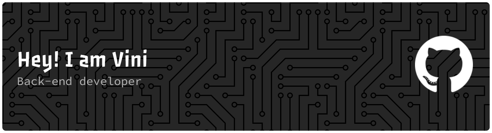

<h1 align="left">Hellooo</h1>

###

  

###

My name is Vini and I'm back-end. from python

###

<h2 align="left">About me</h2>

###

💻Coding since: 2023 📚 I'm currently learning: React 🏫 Studying ADS at: UNIPÊ

###

<h2 align="left">I code with</h2>

###

  
  
  
  
  
  
  
  
  
  
  
  
  
  
  
  
  
  
  

###

<h2 align="left">Stats</h2>

###

  

###

  

###
