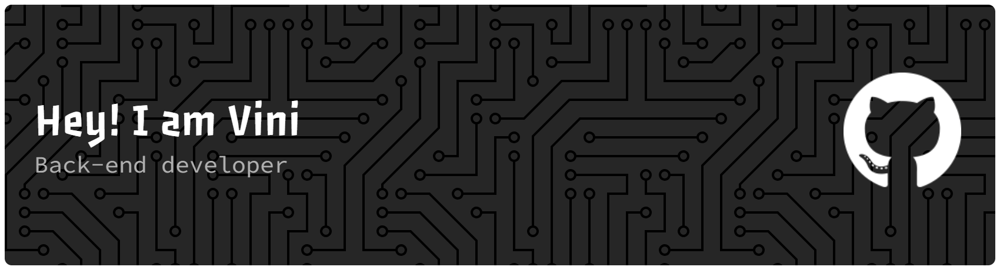

# Olá! Eu sou o Vini 👋

  

## Sobre mim

Sou **Desenvolvedor Back-end em formação**, com interesse em construir APIs, sistemas web e aplicações conectadas a bancos de dados.

Tenho experiência prática com **Python, Flask, SQLAlchemy, JavaScript e Node.js**, **C# e .NET**.

Atualmente curso **Análise e Desenvolvimento de Sistemas (ADS) no UNIPÊ** e busco evoluir constantemente através de projetos práticos e estudos.

* 💻 Programando desde **2023**
* 🎓 ADS — **UNIPÊ**
* 🖥️ Foco atual: **Back-end e desenvolvimento de APIs**
* 📚 Atualmente estudando: **PHP, Laravel, C# e .NET**
* 🚀 Interesse: **desenvolvimento de sistemas, APIs e arquitetura de software**

## 🛠️ Tecnologias

### Back-end

  
  
  
  
  
  
  

### Front-end

  
  
  
  
  
  
  

### Banco de dados & ORM

  
  
  
  
  

### Outras tecnologias

  
  
  
  
  
  
  

## Atualmente

Meu foco principal é evoluir como **desenvolvedor Back-end**, aprofundando meus conhecimentos em:

* APIs REST
* C# e .NET
* Python e Flask
* Node.js
* PostgreSQL e MySQL
* Git e GitHub
* Arquitetura e organização de projetos
* Boas práticas de desenvolvimento

## Projetos

Alguns dos projetos que venho desenvolvendo:

* **HelpMuscle** — Sistema acadêmico para gerenciamento de alunos, professores, turmas e notas.
* **BeeMonitor** — Aplicação web desenvolvida com Python, Flask e banco de dados.
* **HelpDesk API** — API REST para gerenciamento de chamados de suporte técnico.
* **Atlas Finance** — Sistema para gerenciamento e acompanhamento financeiro.

## Contato

  
  

---
